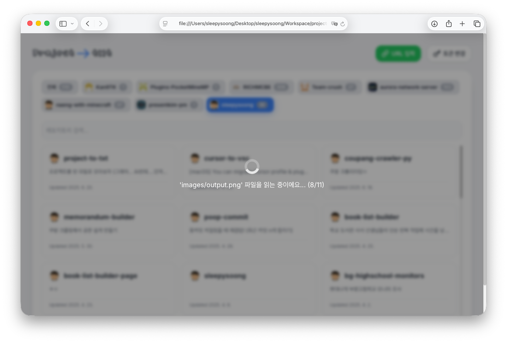
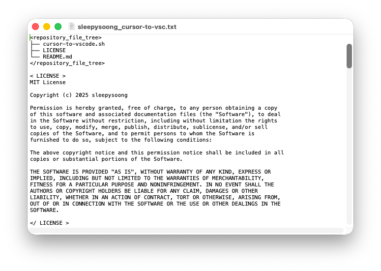

# Project -> txt

프로젝트를 단일 텍스트 파일로 변환해주는 사이트입니다.
AI한테 파일 던져주기 귀찮아서 만들었는데 편하답니다 👍 (제가 쓰려고 만들었어요)

GitHub 레포지토리를 텍스트 파일로 쉽게 변환할 수 있는 웹 애플리케이션입니다.

## 🎯 사용법

1. 💻 **`GitHub Personal Access Token` 입력**
2. 🌐 **변환할 레포지토리를 선택하거나 URL 직접 입력**
3. 😆 **마음껏 즐기기**





## 📄 생성되는 텍스트 파일 예시

```
<repository_file_tree>
my-awesome-project/
├── README.md
├── package.json
├── src/
│   ├── index.js
│   ├── utils/
│   │   └── helper.js
│   └── components/
│       └── Button.js
└── public/
    └── index.html
</repository_file_tree>

<README.md>
이런식으로 디렉토리 구조와 파일 컨텐츠를 보여줍니다
</README.md>

<package.json>
{
  "name": "my-awesome-project",
  "version": "1.0.0",
  "description": "An awesome project",
  "main": "src/index.js",
  "scripts": {
    "start": "node src/index.js",
    "test": "jest"
  },
  "dependencies": {
    "express": "^4.18.0"
  }
}
</package.json>

<src/index.js>
const express = require('express');
const app = express();

app.get('/', (req, res) => {
  res.send('오늘도 좋은 하루 보내세요~');
});

app.listen(3000, () => {
  console.log('Server running on port 3000');
});
</src/index.js>

<src/utils/helper.js>
function formatDate(date) {
  return date.toISOString().split('T')[0];
}

module.exports = { formatDate };
</src/utils/helper.js>
```